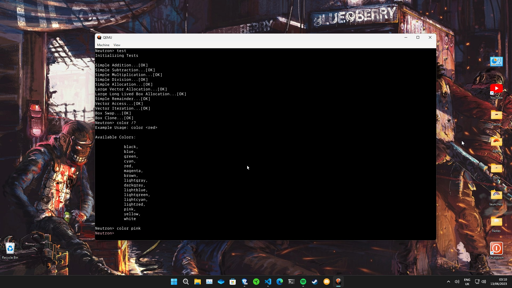
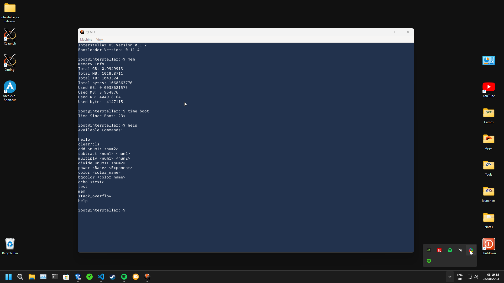
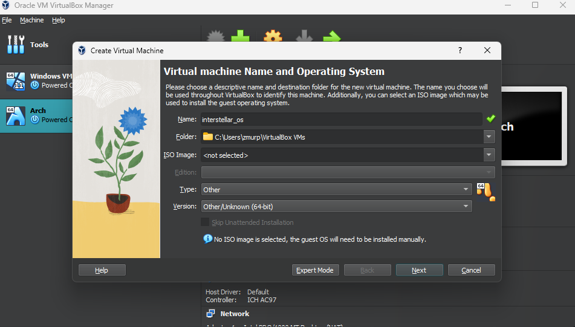
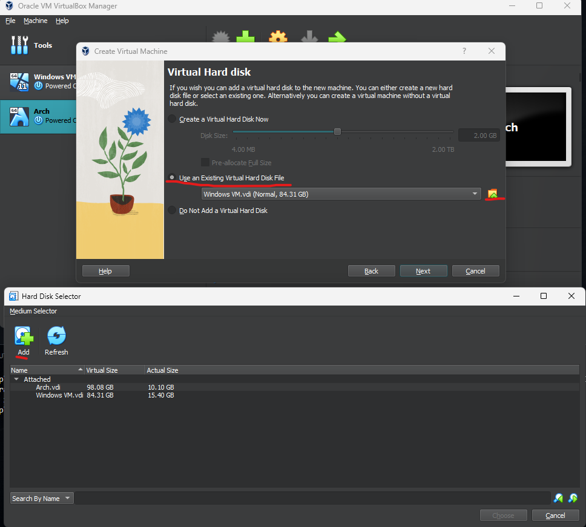
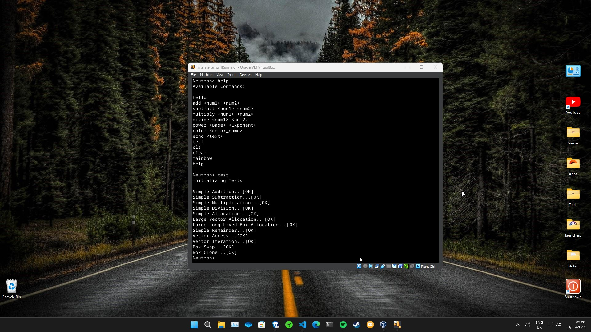
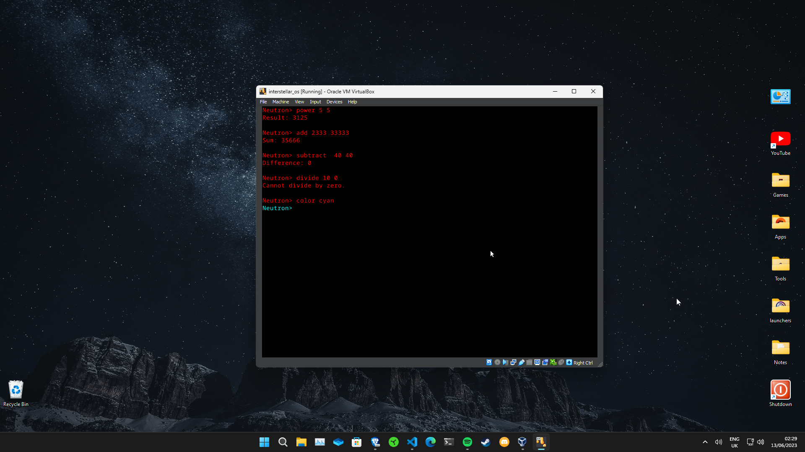
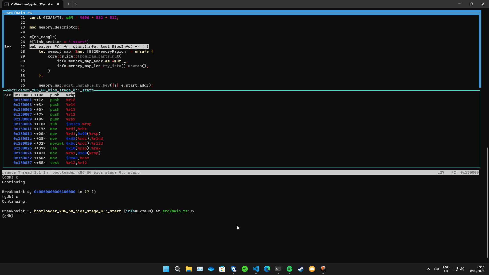
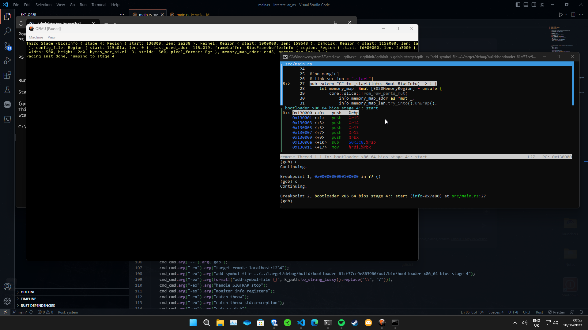

# interstellar OS

      

This project is an Operating System written fully in Rust for x86 64bit (X86_64) that supports both UEFI and BIOS systems.

## Objectives

- My current objectives are to implement a user mode with a file system, GUI, and some simple games like noughts and crosses and chess. I also plan to port the Rust compiler and Python.

- I plan to implement some system calls, then migrate over to Linux system calls to create a lightweight operating system written in Rust that also can run most linux programs that do not require a GUI window. (For GUI apps an X11 server and library would have to be implemented or for every already made graphics library we could translate there X11 calls to use our graphics library instead.)

- I might make it so existing drivers for GPU's NVIDIA ect are downloaded and loaded based on what components are installed (if I legally can).

- I am close to implemeting power management.

- I do not plan to support other architectures as this would complicate the code significantly.

## Functionality

While it might not seem like much from within the OS, there's a lot of code being written behind the scenes (At the time of writing 4616 lines just for code).

Currently, it has a PS/2 keyboard and mouse driver for input. Most VMs can translate your USB keyboard into PS/2 automatically.

Inside the OS, you can see and move your mouse cursor and use the Neutron Shell.

## Hidden Features

These are some hidden features you might be interested in:

- `log` module: For logging errors, warnings, etc. If a kernel panic occurs, it can print a backtrace of the past events, Try call stack_overflow in the neutron shell to see the logger in use.
- `screen` module: For writing pixels and text to the screen. It can also draw shapes using different algorithms.
- `random` module: This module provides a pseudo-random number/letter generator that uses the `RDSEED` instruction to get a random seed.
- `serial` module: This is used for debugging and testing. You can use `serial_println!()` to print to your main computer's stdout when using QEMU.
- Testing framework: I have developed a testing framework for the OS to catch (most) errors before releasing a new version.
- ACPI: by using the acpi and aml crate we can parse computer configuration data to use for things like shutting down the computer.
- Initrd generator and parser: This allows loading files into the kernel's memory on initial launch. These can be used for anything from drivers to preference files.
- Executor: This can be used to execute co-operative tasks in the kernel seemingly at the same time using async code.

## v0.0.1 Running

## Running the OS

I highly recommend using QEMU as described below, but you can use any of the other available options.

### Real Hardware

To run the OS on real hardware, you need to use the Rufus program for Windows or the `dd` command for Linux (Be careful, these tools can wipe your whole PC) and write the file to a USB.

Then insert the USB into the correct machine (x86_64 UEFI or x86_64 BIOS - you likely have a UEFI machine) and change the boot order to boot from the USB first.

If you want mouse/keyboard support, you need to use a PS/2 mouse and keyboard. Alternatively, if your UEFI/BIOS software has a "Legacy USB Support" or "USB Legacy Support" option, you can enable it to translate your USB keyboard and mouse to PS/2. Note that undefined behavior may occur if the OS cannot find the mouse and keyboard.

### QEMU

The easiest way to run this is the QEMU virtual machine.

QEMU Downloads:

- [Windows-64 Bit](https://qemu.weilnetz.de/w64/)

- [Windows-32 Bit](https://qemu.weilnetz.de/w32/)

- [Linux](https://www.qemu.org/download/#linux)

- [MacOS](https://www.qemu.org/download/#macos)

After installing QEMU, I recommend adding it to your environment path variable. Then, run the uefi or bios .img file using QEMU with the correct image name:

`qemu-system-x86_64 -cpu max -drive format=raw,file=interstellar_bios.img`

For using the UEFI .img version QEMU does not support this without us adding custom UEFI firmware which you can download from here:

- Get OVMF-pure-efi.fd - [link](https://github.com/rust-osdev/ovmf-prebuilt/releases/tag/v0.20220719.209%2Bgf0064ac3af)

Add the file to the same directory as the .img and run this command with the correct image name:

`qemu-system-x86_64 -cpu max -bios OVMF-pure-efi.fd -drive format=raw,file=interstellar_uefi.img`

### Virtual box

VirtualBox takes some more setup than QEMU.

- Launch VirtualBox and make a new empty unknown 64-bit machine.

- Allocate the desired number of CPUs and a reasonable amount of memory for the machine if you are using the UEFI version set EFI enabled. Then click on "Use an existing virtual hard disk file," add the .VDI file, and select it.

- Then run it!

## Manually building

To manually build, first clone the repository. Ensure you're using the Rust Nightly Compiler with Rustup, and run this command for the bootloader to work:

`rustup component add llvm-tools-preview`

Instead of having to manually enter the full build/run commands every time I have added build Aliases located in `.cargo/config.toml`

To run the OS, make sure you have qemu-system-x86_64.exe installed and added to your environment path variable. Then, from the root folder, enter:

`cargo u` -UEFI / `cargo b` -BIOS ; `cargo run` defaults to BIOS

If you do not have QEMU and don't want to install it you can manually build the OS from the root folder then run the OS (located in `target/` as `interstellar_uefi.img` or `interstellar_bios.img`) in the VM of your choice (see the section under this to run in virtual box):

WARNING!

BOTH UEFI AND BIOS IMGAGES ARE BUILT USING THE SAME FLAGS SO IF YOU BUILD A BIOS IMAGE THE UEFI IMAGE WILL USE BIOS FUNCTIONS, USE THEM ONE AT A TIME.

IF YOU BUILD ONE, THEN BUILD THE OTHER, THE SECOND ONE WILL DEFINE THE FUNCTIONS OF BOTH!

`cargo bu` -UEFI / `cargo bb` -BIOS / `cargo bur` -UEFI release / `cargo bbr` -BIOS release ; `cargo build` defaults to BIOS

If you want to make a virtual disk image for virtual box you need to use vboxmanage.exe and run this command with the suitable names:

`vboxmanage.exe convertfromraw interstellar_uefi.img virtualbox_os.vdi --format VDI`

I have also added the option to run using GNU debugger add gdb.exe to your environmental path and run this command:

`cargo u -- --gdb` / `cargo b -- --gdb`

WARNING!

YOU MIGHT NEED TO CALL `cargo clean` EVERY TIME BEFORE RUNNING THIS COMMAND FOR IT TO USE THE UPDATED FILE

Enter `c` into the GDB terminal to continue

Currently there is some issues setting up GDB so the source code is not shown and setting breakpoints for function names does not work

I use this upgraded prebuilt version for windows [https://github.com/ssbssa/gdb/releases](https://github.com/ssbssa/gdb/releases) (Credit to ssbssa)

Download the .ZIP: gdb-13.2.90.20230528-x86_64.7z or higher version

Then extract to a suitable directory and add the bin directory as an environmental path so the gdb.exe can be accessed from anywhere

Same steps for linux using any version of gdb you wish

If you want to add more or change automatic commands on launch, edit the files in `gdb/gdbinit`

NOTE:

You may have to manually close both terminals after running with GDB to force the programs to close as sometimes QEMU stays open when connected to GDB

Also when setting address breakpoints interstellar uses ASLR so the addresses randomize every boot

I have also added a full testing framework and test runner that you can easily make tests for in the `interstellar_os/src/tests` folder to run the tests just use `cargo test` like you normally would from the root folder.

Tests are ran for both UEFI and BIOS automatically

You can also pass arguments to the test runner using `cargo test -- arg1 arg2 arg3`

Available Args:

- `--test test_name` - Only runs specified test, it can be used multiple times for example `cargo test -- --test stack_overflow --test random`
- `--verbose` - This logs various debugging details for the test runner itself
- `--uefi` - Only runs tests on UEFI
- `--bios` - only runs tests on BIOS

BIOS tests take a long time to run (as much as 30 seconds each) for some reason, I will look into this eventually but for now only run them when needed.

## Contributing

By contributing to this project, you agree that your contributions will be licensed under this projects current license and you agree to the terms and conditions in this projects license.

Many things need to be implemented see to_do.txt

See [CONTRIBUTING.md](CONTRIBUTING.md) for requirements

## Want to learn how to code your own OS in rust?

If you're interested in coding your own OS in Rust, check out the following resources:

[https://os.phil-opp.com/](https://os.phil-opp.com/) - Uses the old version of bootloader crate, a new version of blog_os will be out soon

[https://wiki.osdev.org/Expanded_Main_Page](https://wiki.osdev.org/Expanded_Main_Page) - mostly low level explanations of operating system concepts
