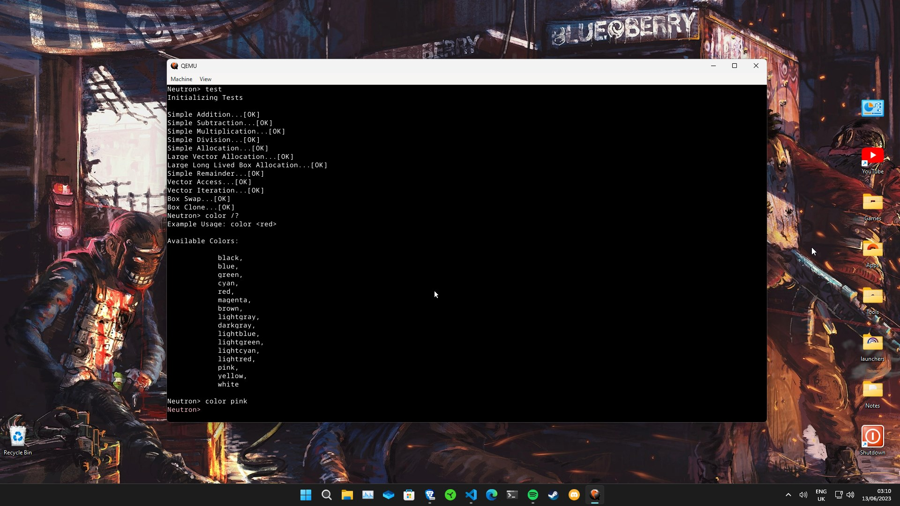
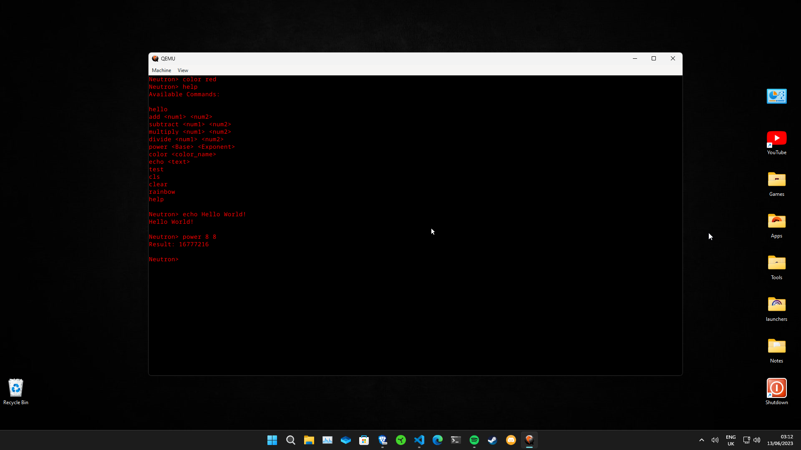
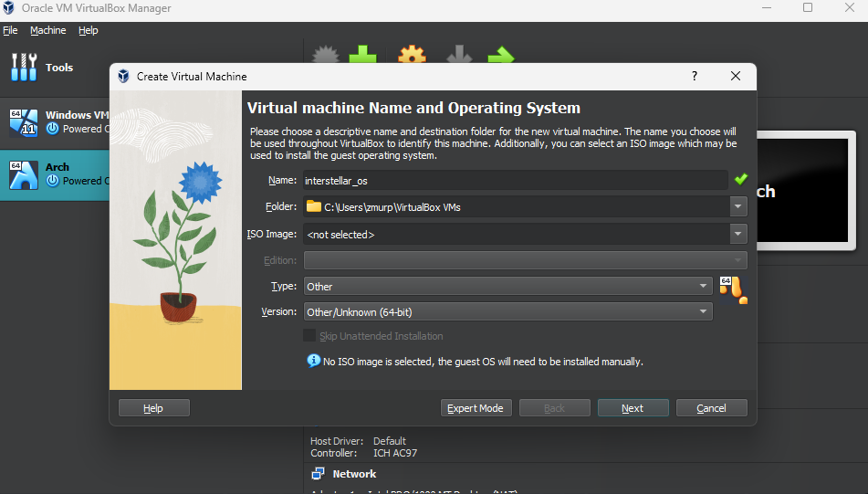
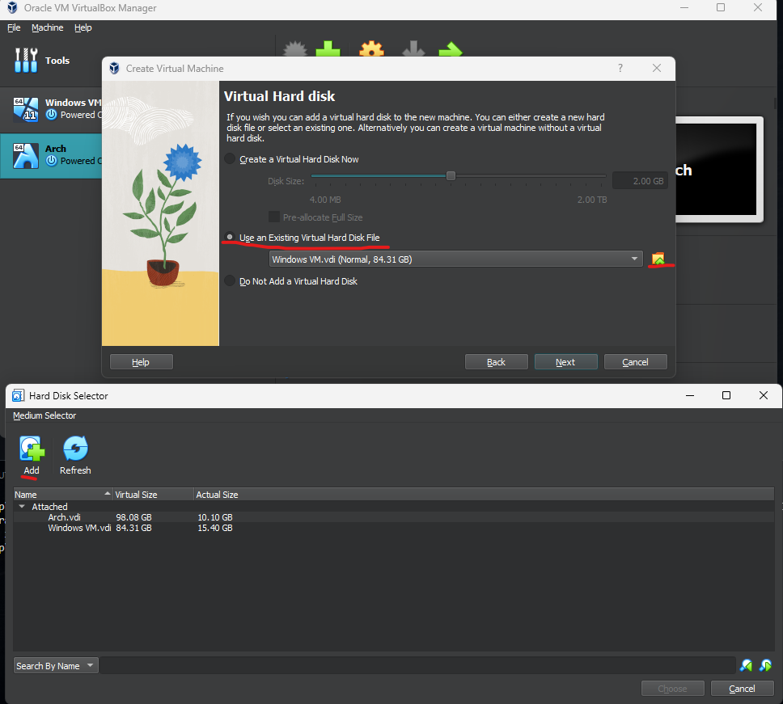
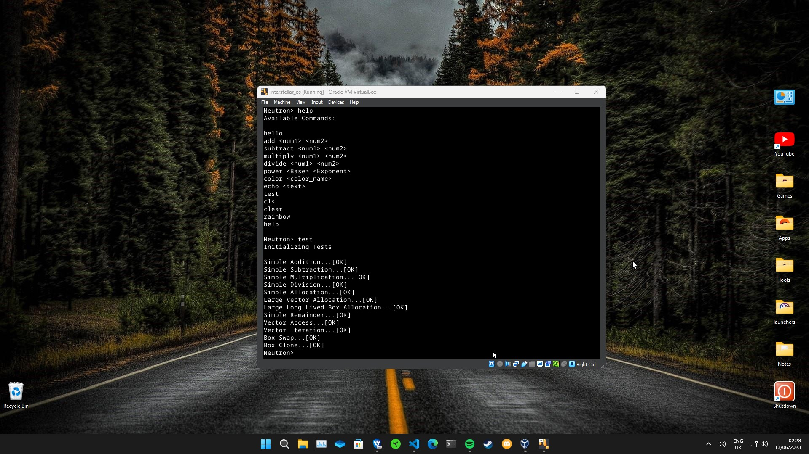
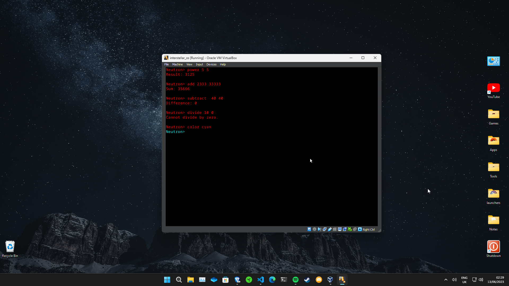
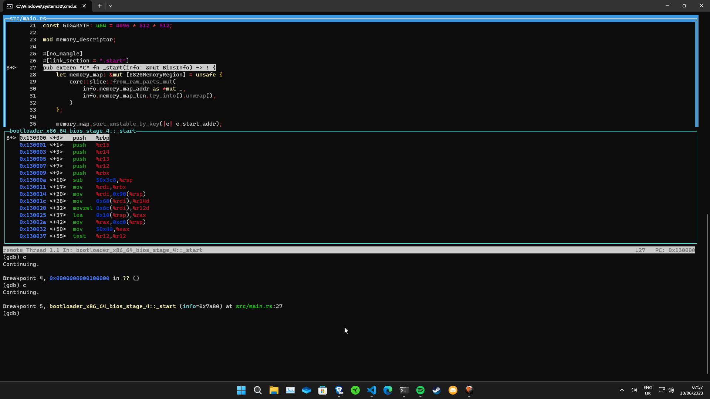
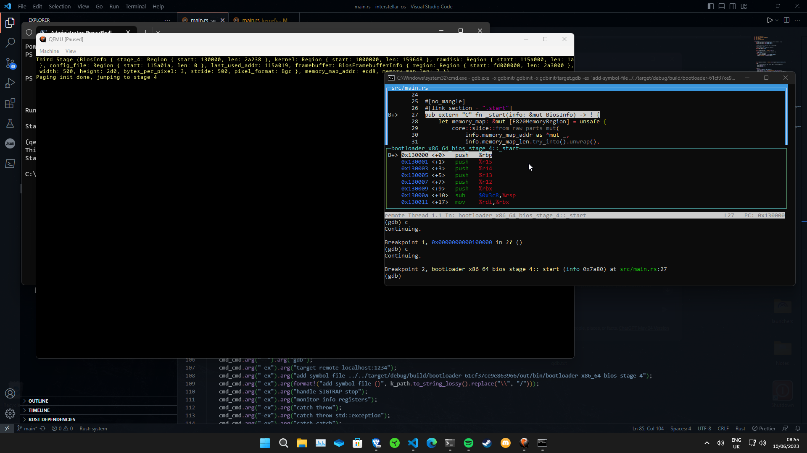

# interstellar_os
This Is My OS That I Am Making Whilst Learning About Rust x86_64 Systems Programing

My Current Aims Are To Implement A User Mode With A File System, GUI, Some Games, Maybe Port The Rust Compiler And Python, And Try To Implement Some Linux System Calls And Run Some Linux Made Apps

It Might Not Seem Much From Inside The OS But There Is Allot Of Code To Make It Work
Currently It Has A PS/2 Keyboard and Mouse Driver As Input But Most VM's Can Translate Your USB Keyboard Into PS/2 Automatically
Inside The OS You Can See Your Mouse Cursor And Use The Neutron Kernel Shell

## Running The OS
From My Knowledge Running The OS Would Require A Full VGA Setup With PS/2 Mouse And Keyboard And Even Then It Would Reset Every Boot,
And You Would Need To Keep The USB In The PC If It Would Even Work At All

But Don't Worry We Can Use A Virtual Machine

### QEMU
The Easiest Way To Run This Is The QEMU Virtual Machine

QEMU Downloads

[Windows-64 Bit](https://qemu.weilnetz.de/w64/)

[Windows-32 Bit](https://qemu.weilnetz.de/w32/)

[Linux](https://www.qemu.org/download/#linux)

[MacOS](https://www.qemu.org/download/#macos)

I Recommend You Add It To Your Environment Path Variable Then

Run The .img File Using QEMU With This Command: `qemu-system-x86_64 -drive format=raw,file=interstellar_os.img`

### Virtual Box
Virtual Box Takes Some More Setup Than QEMU

1. Launch Virtual Box And Make A New Empty Unknown 64 bit Machine

2. Allocate the desired number of CPUs and a reasonable amount of memory for the machine. Then, click on "Use an existing virtual hard disk file," add the .VDI file, and select it.

3. Then Run It!

## Manually Building
Manually Building Is Easy Just Clone The Repository, Make Sure Your Using Rust Nightly Compiler With Rustup And Run This Command For The Bootloader To Work:
`rustup component add llvm-tools-preview`

Make Sure You Have QEMU Installed And Added To Your Environment Path Variable
Then From The Root Folder Run:
`cargo build && cargo run`

I Have Also Added An Upgraded Version Of GNU Debbuger For Windows From Here [https://github.com/ssbssa/gdb](https://github.com/ssbssa/gdb) Credit To ssbssa
And Can Be Ran Automatically When In Debug Build Mode By Changing The GDB Variable To true In Main.rs

For Linux Gnome-terminal users Add Your GDB.exe Into The gdb-linux Bin Folder, Adding It As A Path Variable May Also Work

If You Want To Add More Automatic Commands On Launch Edit The Files In gdb/bin/gdbinit

## Want To Learn How To Code Your Own OS In Rust
If you're interested in coding your own OS in Rust, check out the following resources:
[https://os.phil-opp.com/](https://os.phil-opp.com/)
[https://wiki.osdev.org/Expanded_Main_Page](https://wiki.osdev.org/Expanded_Main_Page)

Feel free to explore these resources to deepen your understanding of OS development in Rust.